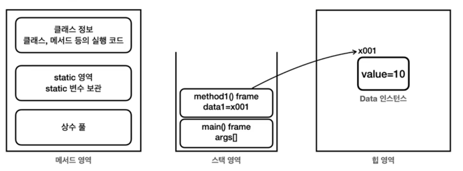
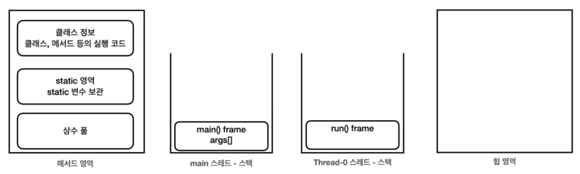
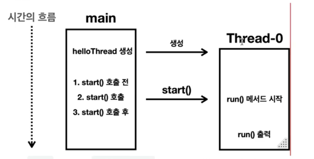
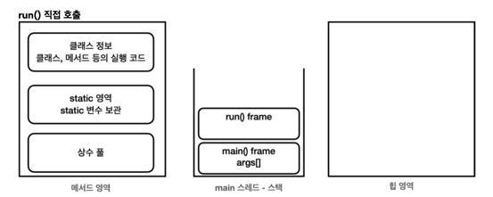
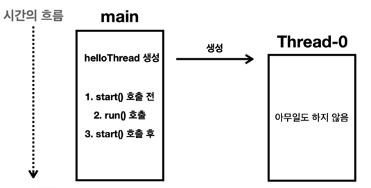

# 스레드의 생성과 실행

## 자바 메모리 구조

* **메서드 영역**: 프로그램을 실행하는데 필요한 공통 데이터를 관리하며, 프로그램 모든 영역에서 공유함
  * 클래스 정보: 클래스의 실행 코드, 필드, 메서드와 생성자 코드 등 모든 실행 코드가 존재
  * static 영역: static 변수 보관
  * 런타임 상수 풀: 프로그램 실행에 필요한 상수 보관  
  

* **스택 영역**: Java 실행 시 1개의 실행 스택이 생성되며 지역 변수, 중간 연산 결과, 메서드 호출 정보 등이 포함됨
  * 스택 프레임: 메서드 호출 시 1개의 스택 프레임이 쌓이며, 메서드가 종료되면 해당 스택 프레임은 제거됨
    

* **힙 영역**: 객체와 배열이 생성되는 영역으로 더 이상 참조되지 않는 객체는 GC가 처리함
  

--- 
  

## 스레드 시작

### 스레드 생성 후
* HelloThread 스레드 객체를 생성한 후 start() 메서드를 호출하면 자바는 스레드를 위한 별도의 스택 공간을 할당함  
  
### 메서드를 실행하면 스택 위에 스택 프레임이 쌓인다
* main 스레드는 main() 메서드의 스택 프로임에 스택을 올리면서 시작함
* 직접 만든 스레드는 run() 메서드의 스택 프레임에 스택을 올리면서 run() 메서드 시작

### 시간 흐름에 따른 분석

* 🌟 main 스레드가 run() 메서드를 실행하는 것이 아닌, **Thread-0** 스레드가 run() 메서드를 호출한다
* main 메서드는 단지 start() 메서드로 Thread-0 스레드에게 실행을 지시할 뿐, 직접 run() 메서드를 호출하지 않음
* 즉, run()은 main이 아닌 별도 스레드에서 실행됨

### 스레드 간 실행 순서는 보장되지 않는다
* 스레드는 동시에 실행되기에 스레드 간 실행 순서는 보장되지 않음 => 이것이 ***멀티스레드***

### Main에서 run() 직접 호출하면?

* main 스레드가 직접 run() 호출함
  
  

* 결과적으로 main 스레드에서 모든 것을 처리함

* 즉, 스레드의 start() 메서드는 스레드의 스택 공간을 할당하면서 스레드를 시작시키고 run() 메서드를 실행시키는 아주 특별한 메서드임
* main 스레드가 아닌 별도의 스레드에서 재정의한 run() 메서드를 실행하려면 반드시 start() 메서드를 호출해야함