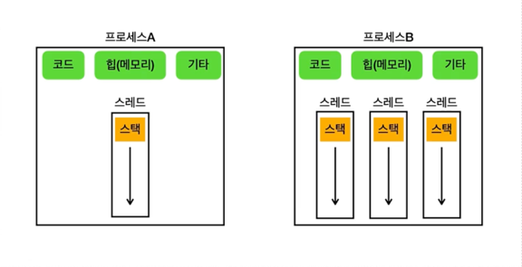

# 프로세스와 스레드

## 멀티태스킹
* 하나의 컴퓨터 시스템(단일 CPU 코어)이 동시에 여러 작업을 번갈아가며 수행하는 능력**
* (cf) CPU에 어떤 프로그램이 얼마만큼 실행될지 결정하는 **스케줄링**은 운영체제가 결정
  * CPU 코어란? => 실제 연산을 처리하는 코어

## 멀티프로세싱
* 하나의 컴퓨터 시스템에서 둘 이상의 프로세서(CPU 코어)를 사용하여 여러 작업을 동시에 처리하는 기술
  * 멀티프로세싱 시스템은 하나의 CPU 코어만을 사용하는 시스템보다 동시에 더 많은 작업 처리 가능함

---
## 프로세스 (Process)

* 프로그램은 실제 실행하기 전까지 단순한 실행 파일에 불과
* 프로그램을 실행하면 `프로세스`가 만들어지고 프로그램이 실행됨
* 운영체제 안에서 실행중인 프로그램을 `프로세스`라고 함
* 프로세스는 실행중인 프로그램의 인스턴스
* 독립적인 메모리 공간을 가짐 -> 별도의 작업 단위로 분리됨 -> 서로 간섭 불가
* 프로세스의 메모리 구성
  * 코드 섹션: 프로그램의 코드가 저장되는 부분
  * 데이터 섹션: 전역 변수 및 정적 변수가 저장되는 부분
  * `힙 (Heap)`: 동적으로 할당하는 메모리 영역
  * `스택 (Stack)`: 메서드(함수) 호출 시 생성되는 지역 변수와 반환 주소가 저장되는 영역 (**스레드에 포함**)

## 스레드 (Thread)
### 프로세스는 하나 이상의 스레드를 반드시 포함한다.
* 스레드 => **프로세스 내에서 명령어를 실행하는 실행 단위**
* 스레드는 동일한 메모리 영역을 공유함
* 프로세스는 실행 환경과 자원을 제공하는 컨테이너 역할, 스레드는 CPU를 사용해 코드를 실행

### 메모리 구성
* **공유 메모리**: 같은 프로세스의 코드 섹션, 힙 (메모리)은 프로세스 내에서 모든 스레드가 공유함
* ***개별 스택***: 각 스레드는 자신만의 스택을 가짐